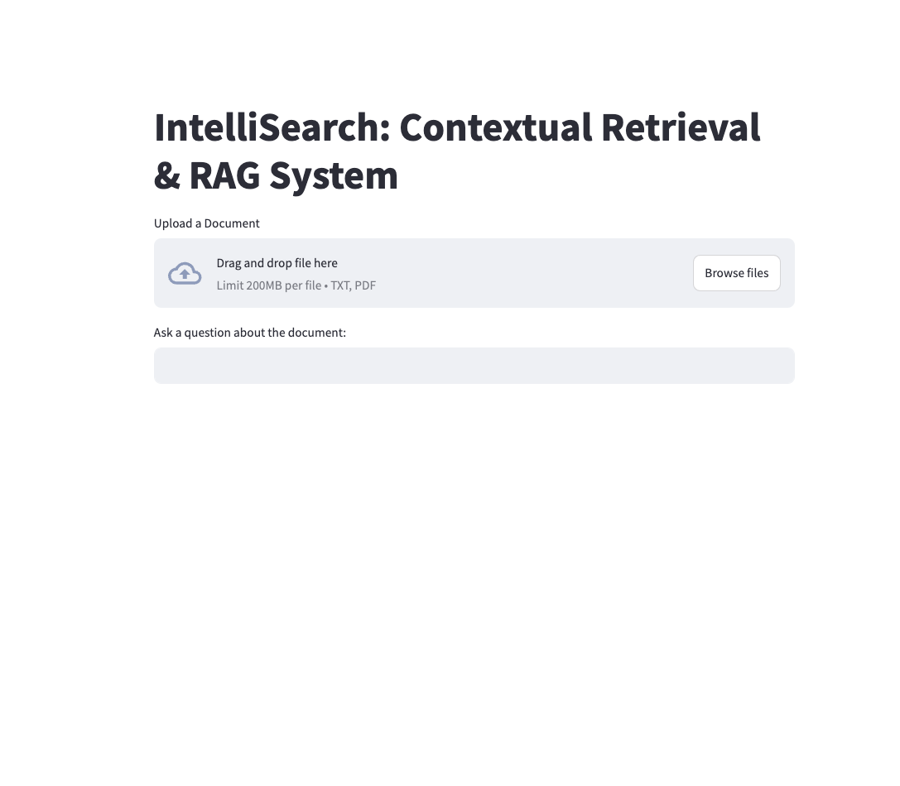
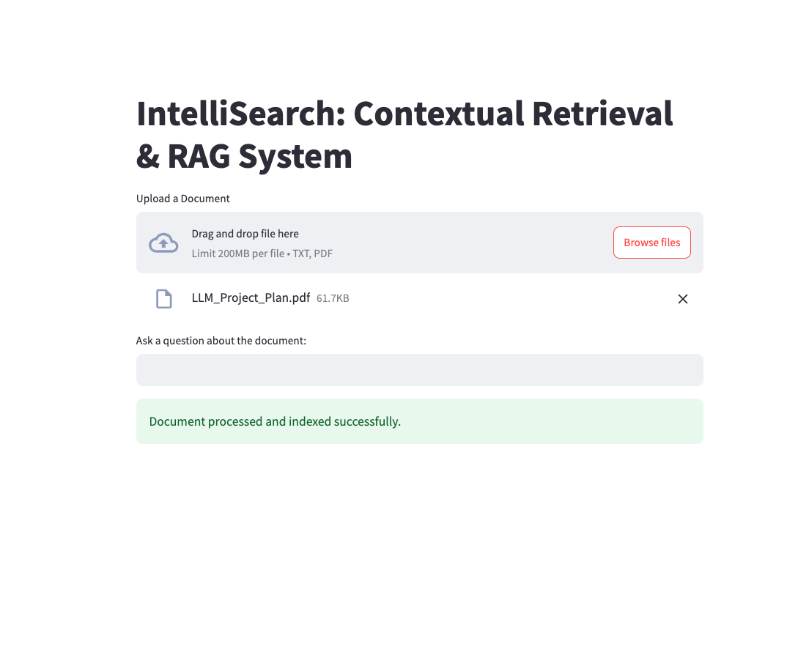
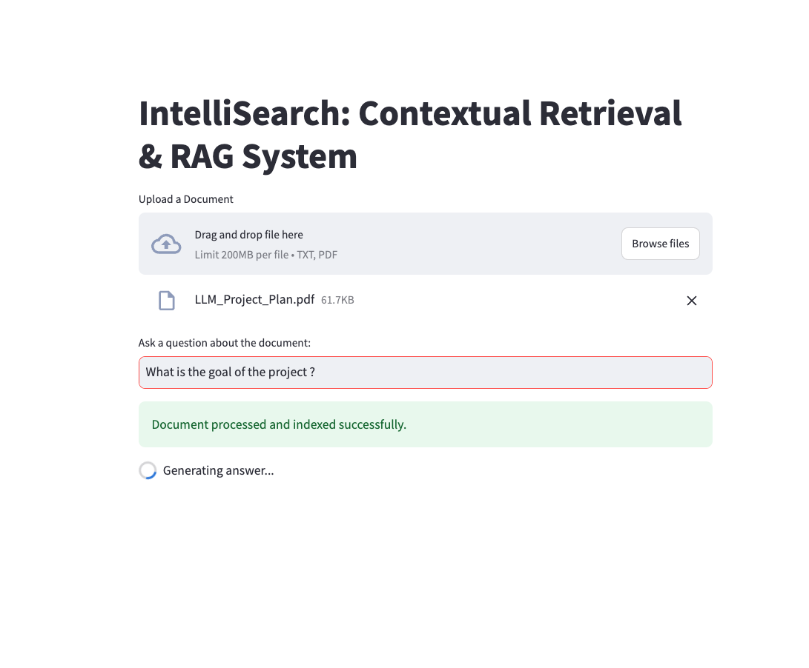
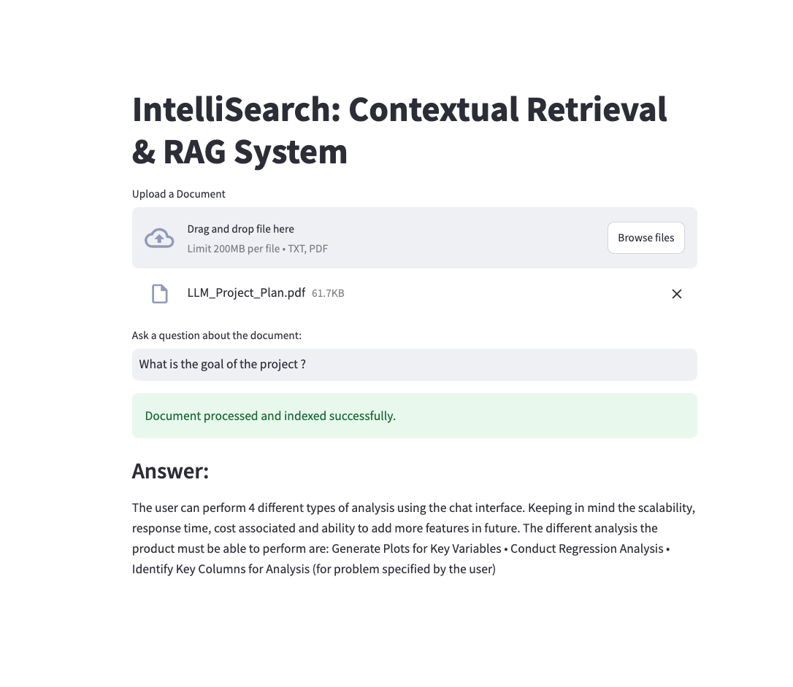

# IntelliSearch: Contextual Retrieval & RAG System
An App that answers your questions based on information from uploaded documents(pdf/text files)

<!-- Replace with actual image path -->
<!--   -->

## Table of Contents

- [Introduction](#introduction)
- [Features](#features)
- [Demo](#demo)
- [Installation](#installation)
- [Usage](#usage)
- [Project Structure](#project-structure)
- [Technologies Used](#technologies-used)
<!-- - [Contributing](#contributing)
- [License](#license)
- [Acknowledgements](#acknowledgements) -->

---

## Introduction

**IntelliSearch** is a state-of-the-art Retrieval Augmented Generation (RAG) system that allows users to upload documents (PDF or text files) and ask questions about the content. The system provides accurate and contextually relevant answers by integrating semantic chunking, vector search, and advanced language models.

---

## Features

- **Document Upload**: Supports uploading PDF and text documents via a user-friendly Streamlit interface.
- **Semantic Chunking**: Utilizes Transformer-based models (BigBird) for semantic segmentation of documents, ensuring coherent chunking of content.
- **Vector Search with FAISS**: Implements FAISS for efficient similarity search over embedded document chunks.
- **Advanced Language Models**: Integrates open-source LLMs (e.g., FLAN-T5) for generating well-structured and accurate answers.
- **Optimized Prompt Engineering**: Enhances response quality without extensive model fine-tuning.
- **Dynamic Context Injection**: Retrieves and feeds relevant document chunks to the LLM for precise answer generation.

---

## Demo
<details>
<summary>Click here to have a look</summary>

<!-- Include screenshots or a GIF of the application in action -->



*Figure 1: Dashboard after opening the landing webpage.*



*Figure 2: Uploading a document through the Streamlit interface.*



*Figure 3: Asking a relevant question.*



*Figure 4: Receiving an answer based on the document's content.*
</details>

<br></br>
---

## Installation

### Prerequisites

- Python 3.7 or higher
- pip package manager

### Required Libraries

Install the required Python packages using the following command:

```bash
pip install -r requirements.txt
```

---

## Usage

1. Clone the repository
```bash
git clone https://github.com/your_username/IntelliSearch.git
cd IntelliSearch
```

2. Run the application
    Run the following command in terminal with the relevant enviroment activated
```bash
streamlit run main.py
```

3. Interact with the App

- Open the URL provided in the terminal (usually http://localhost:8501) in your web browser.
- Upload a PDF or text document.
- Type your question in the input box.
- Receive an answer based on the content of your uploaded document.

---


## Project Structure
```
IntelliSearch/
├── main.py                 # Main Streamlit application script
├── main.ipynb              # Same workflow in jupyter notebook
├── env.yml                 # Python dependencies
├── README.md               # Project documentation
├── images/                 # Folder for images and screenshots
    ├── demo_screenshot_1.png
    └── demo_screenshot_2.png
```
<!-- └── models/                 # Pre-trained models (optional) -->

---

## Technologies Used

- **Streamlit**: For building the interactive web application interface.
- **FAISS**: For efficient vector similarity search and indexing.
- **Transformers**: Provides state-of-the-art machine learning models like BigBird and FLAN-T5.
- **Sentence Transformers**: For generating embeddings of text chunks and queries.
- **LangChain**: Simplifies the integration of language models into applications.
- **PyPDF2**: For reading and extracting text from PDF documents.
- **Torch**: Deep learning framework used by Transformer models.

---